# Manifest Perps DEX - Architecture Guide

A perpetual futures Central Limit Order Book (CLOB) built on the Manifest protocol on Solana, with MagicBlock ephemeral rollup integration.

---

## Table of Contents

1. [High-Level Overview](#1-high-level-overview)
2. [Account Model](#2-account-model)
3. [Instruction Set](#3-instruction-set)
4. [Market Lifecycle](#4-market-lifecycle)
5. [Order Matching Engine](#5-order-matching-engine)
6. [Position & Margin System](#6-position--margin-system)
7. [Funding Rate Mechanics](#7-funding-rate-mechanics)
8. [Liquidation Engine](#8-liquidation-engine)
9. [Insurance Fund](#9-insurance-fund)
10. [Token Flow & Virtual Base](#10-token-flow--virtual-base)
11. [MagicBlock Integration](#11-magicblock-integration)
12. [Type System & Price Representation](#12-type-system--price-representation)
13. [Log Events](#13-log-events)
14. [Safety Invariants](#14-safety-invariants)
15. [File Map](#15-file-map)

---

## 1. High-Level Overview

```
┌────────────────────────────────────────────────────────────────────┐
│                        MANIFEST PERPS DEX                          │
│                                                                    │
│  ┌──────────┐  ┌──────────┐  ┌──────────┐  ┌──────────────────┐    │
│  │  Traders │  │  Makers  │  │Liquidator│  │  Funding Cranker │    │
│  └────┬─────┘  └────┬─────┘  └────┬─────┘  └────────┬─────────┘    │
│       │             │             │                 │              │
│       ▼             ▼             ▼                 ▼              │
│  ┌─────────────────────────────────────────────────────────────┐   │
│  │                    INSTRUCTION ROUTER                       │   │
│  │  Swap | BatchUpdate | Deposit | Withdraw | Liquidate | ...  │   │
│  └─────────────────────────┬───────────────────────────────────┘   │
│                             │                                      │
│       ┌─────────────────────┼─────────────────────┐                │
│       ▼                     ▼                     ▼                │
│  ┌──────────┐    ┌───────────────────┐    ┌────────────────┐       │
│  │  Margin  │    │  Matching Engine  │    │ Funding System │       │
│  │  System  │    │  (Red-Black Tree  │    │ (Lazy Cumul.)  │       │
│  │          │    │   Bid/Ask CLOB)   │    │                │       │
│  └──────────┘    └───────────────────┘    └────────────────┘       │
│       │                     │                     │                │
│       └─────────────────────┼─────────────────────┘                │
│                             ▼                                      │
│  ┌─────────────────────────────────────────────────────────────┐   │
│  │                    MARKET ACCOUNT (PDA)                     │   │
│  │  ┌───────────────┐ ┌──────────┐ ┌─────────┐ ┌───────────┐   │   │
│  │  │  MarketFixed  │ │  Bids    │ │  Asks   │ │  Seats    │   │   │
│  │  │  (256 bytes)  │ │  (RBTree)│ │ (RBTree)│ │  (RBTree) │   │   │
│  │  └───────────────┘ └──────────┘ └─────────┘ └───────────┘   │   │
│  └─────────────────────────────────────────────────────────────┘   │
│                             │                                      │
│                             ▼                                      │
│  ┌──────────────┐    ┌───────────────┐    ┌────────────────┐       │
│  │  Quote Vault │    │  Pyth Oracle  │    │  MagicBlock ER │       │
│  │  (USDC PDA)  │    │  (Price Feed) │    │  (Delegation)  │       │
│  └──────────────┘    └───────────────┘    └────────────────┘       │
└────────────────────────────────────────────────────────────────────┘
```

**Key Design Principles:**
- **Virtual Base**: Only USDC moves on-chain. The base asset (e.g., SOL) is purely a ledger entry.
- **Single Account**: The entire orderbook, all trader seats, and all positions live in one PDA account.
- **Lazy Funding**: O(1) global crank; per-trader settlement on next interaction.
- **Partial Liquidation**: Closes only enough position to restore margin health.
- **Insurance Fund**: Virtual USDC buffer funded by taker fees, covers bad debt.

---

## 2. Account Model

### 2.1 Market Account Layout

Every market is a single PDA with a fixed header + dynamic region:

```
┌─────────────────────────────────────────────────────────────┐
│                    MARKET ACCOUNT (PDA)                      │
│ seeds: [b"market", &[base_mint_index], quote_mint.as_ref()] │
├─────────────────────────────────────────────────────────────┤
│                                                             │
│  FIXED REGION (256 bytes)                                   │
│  ┌─────────────────────────────────────────────────────┐    │
│  │  discriminant (8)  │ version (1) │ base_mint_idx(1) │    │
│  │  base_decimals (1) │ quote_decimals (1)             │    │
│  │  quote_mint (32)                                    │    │
│  │  order_sequence_number (8)                          │    │
│  │  num_bytes_allocated (4)                            │    │
│  │  bids_root / bids_best / asks_root / asks_best (16)│    │
│  │  seats_root / free_list_head (8)                    │    │
│  │  quote_volume (8)                                   │    │
│  │─ ─ ─ ─ ─ PERPS FIELDS (160 bytes) ─ ─ ─ ─ ─ ─ ─ ─│    │
│  │  initial_margin_bps (8) │ maintenance_margin_bps (8)│    │
│  │  total_long_base (8)    │ total_short_base (8)      │    │
│  │  pyth_feed_account (32)                             │    │
│  │  oracle_price_mantissa (8) │ oracle_expo_pad (8)    │    │
│  │  last_funding_timestamp (8)                         │    │
│  │  cumulative_funding (8)                             │    │
│  │  insurance_fund_balance (8)                         │    │
│  │  taker_fee_bps (8) │ liquidation_buffer_bps (8)     │    │
│  │  _padding3 [5 x u64]                               │    │
│  └─────────────────────────────────────────────────────┘    │
│                                                             │
│  DYNAMIC REGION (variable, grows via expand)                │
│  ┌──────┐┌──────┐┌──────┐┌──────┐┌──────┐┌──────┐         │
│  │Block0││Block1││Block2││Block3││Block4││ ...  │         │
│  │80 B  ││80 B  ││80 B  ││80 B  ││80 B  ││      │         │
│  └──────┘└──────┘└──────┘└──────┘└──────┘└──────┘         │
│                                                             │
│  Each 80-byte block is either:                              │
│  - A ClaimedSeat node (64B payload + 16B RBTree overhead)   │
│  - A RestingOrder node (64B payload + 16B RBTree overhead)  │
│  - A free block (linked in free-list)                       │
└─────────────────────────────────────────────────────────────┘
```

### 2.2 ClaimedSeat (64 bytes)

Each trader has one seat with **repurposed fields** for perps:

```
┌───────────────────────────────────────────────────────────┐
│                 ClaimedSeat (64 bytes)                     │
├──────────────────────┬────────────────────────────────────┤
│  Field               │  Perps Usage                       │
├──────────────────────┼────────────────────────────────────┤
│  trader (32B)        │  Trader's public key               │
│  base_balance (8B)   │  last_cumulative_funding (i64)     │
│  quote_balance (8B)  │  USDC margin balance (unchanged)   │
│  quote_volume (8B)   │  position_size (i64: +long/-short) │
│  _padding (8B)       │  quote_cost_basis (u64 LE)         │
└──────────────────────┴────────────────────────────────────┘
```

### 2.3 PDA Derivations

```
Market PDA:
  seeds = [b"market", &[base_mint_index: u8], quote_mint.as_ref()]

Quote Vault PDA:
  seeds = [b"vault", market.as_ref(), quote_mint.as_ref()]
  (self-owned: authority = vault PDA itself)

Global PDA (cross-market):
  seeds = [b"global", mint.as_ref()]
```

### 2.4 Orderbook Structure

```
                    ┌──────────────────┐
                    │   MarketFixed    │
                    │                  │
                    │  bids_root ──────┼──┐
                    │  bids_best ──────┼──┼──┐
                    │  asks_root ──────┼──┼──┼──┐
                    │  asks_best ──────┼──┼──┼──┼──┐
                    └──────────────────┘  │  │  │  │
                                          │  │  │  │
   BIDS (descending by price)             │  │  │  │
   ┌─────────────────────────────┐        │  │  │  │
   │      Red-Black Tree         │◄───────┘  │  │  │
   │                             │           │  │  │
   │  ┌──────┐  ┌──────┐        │           │  │  │
   │  │$10.50│◄─┤$10.00│  ...   │           │  │  │
   │  │ BEST │  │      │        │◄──────────┘  │  │
   │  └──────┘  └──────┘        │              │  │
   └─────────────────────────────┘              │  │
                                                │  │
   ASKS (ascending by price)                    │  │
   ┌─────────────────────────────┐              │  │
   │      Red-Black Tree         │◄─────────────┘  │
   │                             │                 │
   │  ┌──────┐  ┌──────┐        │                 │
   │  │$10.60│──┤$11.00│  ...   │                 │
   │  │ BEST │  │      │        │◄────────────────┘
   │  └──────┘  └──────┘        │
   └─────────────────────────────┘
```

---

## 3. Instruction Set

```
┌────┬──────────────────┬────────────────────────────────────────────┐
│ #  │ Instruction       │ Description                                │
├────┼──────────────────┼────────────────────────────────────────────┤
│  0 │ CreateMarket      │ Initialize market PDA + quote vault PDA   │
│  1 │ ClaimSeat         │ Register a trader on the market           │
│  2 │ Deposit           │ Transfer USDC from wallet to vault        │
│  3 │ Withdraw          │ Transfer USDC from vault to wallet        │
│  4 │ Swap              │ IOC market order (auto-claims seat)       │
│  5 │ Expand            │ Grow market account (add free blocks)     │
│  6 │ BatchUpdate       │ Cancel N orders + place M orders          │
│  7 │ GlobalCreate      │ Create cross-market global account        │
│  8 │ GlobalAddTrader   │ Register to global account                │
│  9 │ GlobalDeposit     │ Deposit into global account               │
│ 10 │ GlobalWithdraw    │ Withdraw from global account              │
│ 11 │ GlobalEvict       │ Evict underfunded global trader           │
│ 12 │ GlobalClean       │ Remove stale global order                 │
│ 13 │ SwapV2            │ Swap with separate payer/owner            │
│ 14 │ DelegateMarket    │ Delegate to MagicBlock ER                 │
│ 15 │ CommitMarket      │ Commit ER state to mainnet                │
│ 16 │ Liquidate         │ Liquidate underwater position             │
│ 17 │ CrankFunding      │ Update funding rate from Pyth oracle      │
└────┴──────────────────┴────────────────────────────────────────────┘
```

---

## 4. Market Lifecycle

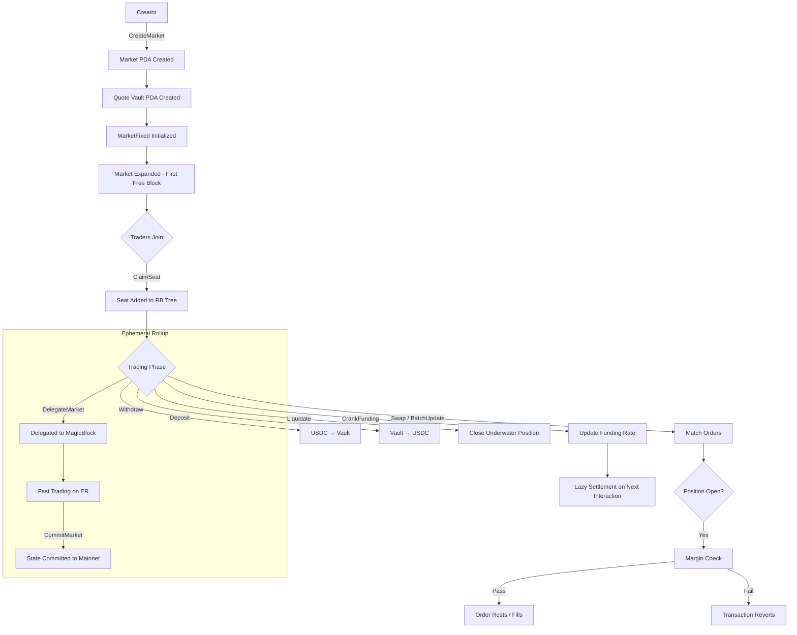

### CreateMarket Flow

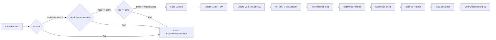

---

## 5. Order Matching Engine

### 5.1 Matching Flow (place_order)

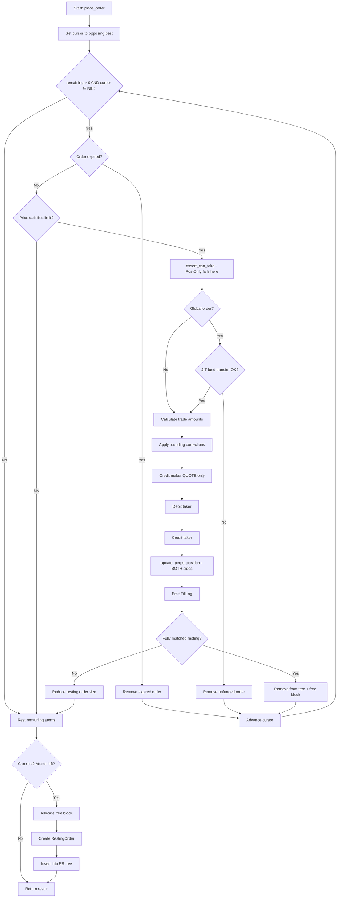

### 5.2 Balance Update Rules (Perps-Aware)

```
┌─────────────────────────────────────────────────────────────┐
│         MATCHING BALANCE UPDATES (PERPS MODE)               │
│                                                             │
│  Taker BUYS (is_bid = true):                                │
│  ┌─────────────┬─────────────┬────────────┐                 │
│  │   Action    │   Party     │   Asset    │                 │
│  ├─────────────┼─────────────┼────────────┤                 │
│  │  DEBIT      │   Taker     │   Quote    │  ✓ real USDC    │
│  │  CREDIT     │   Maker     │   Quote    │  ✓ real USDC    │
│  │  CREDIT     │   Taker     │   Base     │  ✓ virtual      │
│  │  SKIP       │   Maker     │   Base     │  ✗ would corrupt│
│  │             │             │            │    maker funding │
│  └─────────────┴─────────────┴────────────┘                 │
│                                                             │
│  Taker SELLS (is_bid = false):                              │
│  ┌─────────────┬─────────────┬────────────┐                 │
│  │  DEBIT      │   Taker     │   Base     │  ✓ virtual      │
│  │  SKIP       │   Maker     │   Base     │  ✗ would corrupt│
│  │  CREDIT     │   Taker     │   Quote    │  ✓ real USDC    │
│  └─────────────┴─────────────┴────────────┘                 │
│                                                             │
│  WHY: base_withdrawable_balance stores cumulative funding   │
│  between transactions. Modifying it for non-current-tx      │
│  makers would corrupt their funding checkpoint.             │
└─────────────────────────────────────────────────────────────┘
```

### 5.3 Perps Position Tracking (update_perps_position)

Called for **both maker and taker** after every fill:

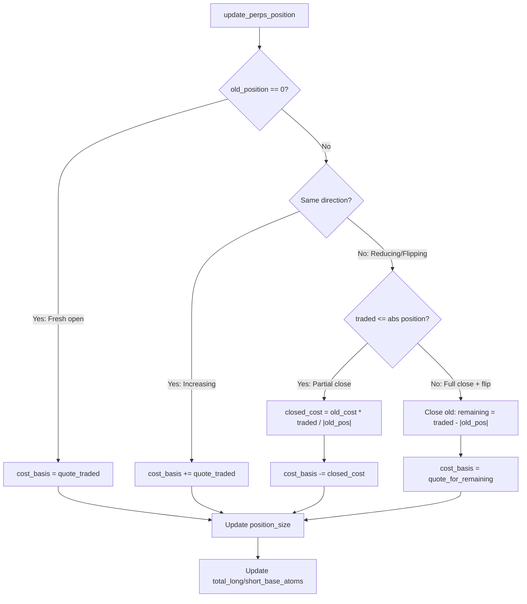

---

## 6. Position & Margin System

### 6.1 Equity Calculation

```
┌─────────────────────────────────────────────────────────────┐
│                    EQUITY FORMULA                            │
│                                                             │
│  notional = mark_price * |position_size|                    │
│                                                             │
│  unrealized_pnl =                                           │
│    LONG:  notional - cost_basis                              │
│    SHORT: cost_basis - notional                              │
│                                                             │
│  equity = quote_balance + unrealized_pnl                    │
│                                                             │
│  All computed using i128 to prevent overflow                │
└─────────────────────────────────────────────────────────────┘
```

### 6.2 Margin Checks

```mermaid
flowchart TD
    subgraph "Initial Margin (After Swap/BatchUpdate)"
        A1[Compute mark_price] --> B1["notional = mark * |position|"]
        B1 --> C1["required = notional * initial_margin_bps / 10000"]
        C1 --> D1{"equity >= required?"}
        D1 -->|Yes| E1[Order Succeeds]
        D1 -->|No| F1[Revert: InsufficientMargin]
    end

    subgraph "Maintenance Margin (On Withdraw)"
        A2[Compute mark_price] --> B2["notional = mark * |position|"]
        B2 --> C2["required = notional * maintenance_margin_bps / 10000"]
        C2 --> D2{"equity >= required?"}
        D2 -->|Yes| E2[Withdrawal Succeeds]
        D2 -->|No| F2[Revert: InsufficientMargin]
    end

    subgraph "Liquidation Threshold"
        A3[Compute mark_price] --> B3["required = notional * maintenance_margin_bps / 10000"]
        B3 --> C3{"equity < required?"}
        C3 -->|Yes| D3[Position is Liquidatable]
        C3 -->|No| E3[Revert: NotLiquidatable]
    end
```

### 6.3 Mark Price Resolution

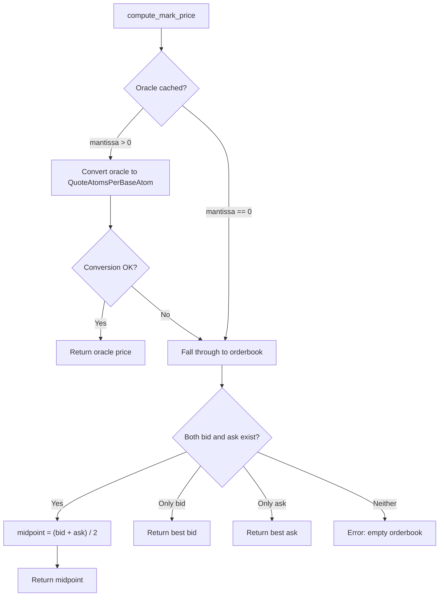

---

## 7. Funding Rate Mechanics

### 7.1 The Lazy Cumulative Model

```
┌─────────────────────────────────────────────────────────────────┐
│                  LAZY FUNDING ARCHITECTURE                       │
│                                                                 │
│  TRADITIONAL:  Crank iterates all N traders → O(N) per crank   │
│  THIS SYSTEM:  Crank updates ONE global counter → O(1)         │
│                Settlement is per-trader on next interaction     │
│                                                                 │
│  ┌─────────┐    ┌─────────────────────┐    ┌─────────────┐     │
│  │  Crank   │───▶│  cumulative_funding │    │  Trader A   │     │
│  │ (O(1))   │    │  (global counter)   │    │  last = 500 │     │
│  └─────────┘    └─────────────────────┘    │  pos = +10  │     │
│                          │                  └──────┬──────┘     │
│                          │                         │            │
│                          │    On next interaction:  │            │
│                          │    delta = 700 - 500     │            │
│                          │    owed = 10 * 200 / 1e9 │            │
│                          ▼                         ▼            │
│                  cumulative = 700          margin -= owed       │
│                                           last = 700           │
└─────────────────────────────────────────────────────────────────┘
```

### 7.2 CrankFunding Flow

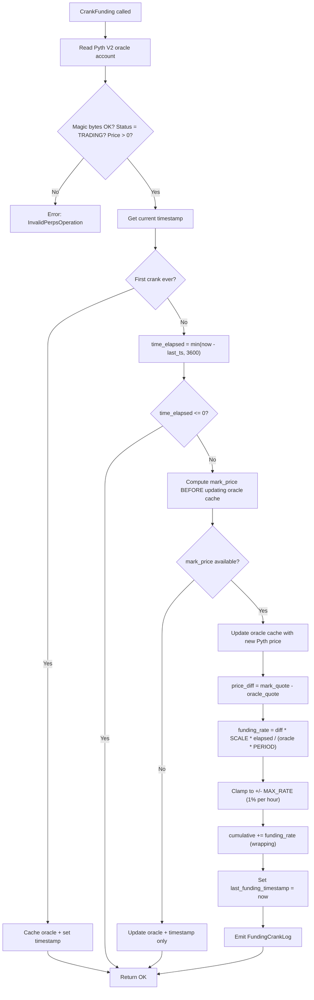

### 7.3 Per-Trader Settlement (settle_funding_for_trader)

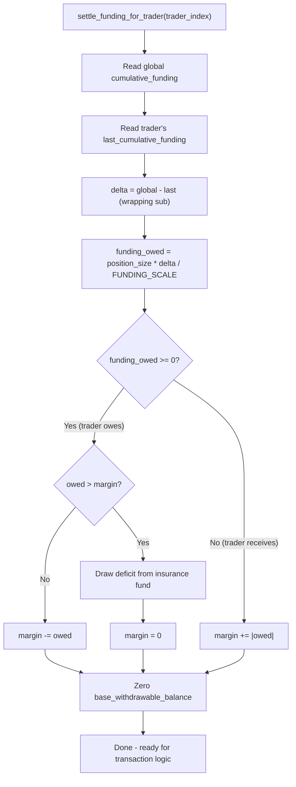

### 7.4 Funding Direction Convention

```
mark_price > oracle_price
  → funding_rate > 0
  → LONGS PAY SHORTS
  → Pushes mark DOWN toward oracle

mark_price < oracle_price
  → funding_rate < 0
  → SHORTS PAY LONGS
  → Pushes mark UP toward oracle
```

---

## 8. Liquidation Engine

### 8.1 Complete Liquidation Flow

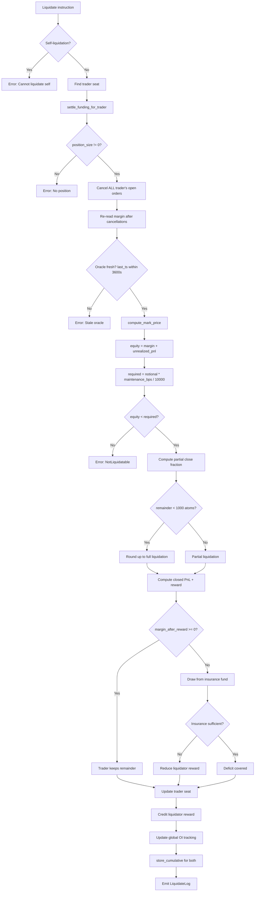

### 8.2 Partial Liquidation Math

```
┌─────────────────────────────────────────────────────────────────┐
│              PARTIAL LIQUIDATION FORMULA                         │
│                                                                 │
│  Goal: close fraction f of position to restore margin health    │
│                                                                 │
│  After closing f:                                               │
│    new_equity   = equity - f * notional * REWARD_BPS / 10000    │
│    new_notional = (1 - f) * notional                            │
│    Target: new_equity >= new_notional * target_bps / 10000      │
│                                                                 │
│  where target_bps = maintenance_margin_bps + liquidation_buffer │
│                                                                 │
│  Solving for f:                                                 │
│    equity_bps = equity * 10000 / notional                       │
│                                                                 │
│         target_bps - equity_bps                                 │
│    f = ─────────────────────────                                │
│         target_bps - REWARD_BPS                                 │
│                                                                 │
│    close_amount = ceil(f * |position_size|)                     │
│                                                                 │
│  If f >= 1 or denominator <= 0 → FULL liquidation               │
│  If remainder < MIN_POSITION_SIZE (1000) → round to FULL        │
│                                                                 │
│  EXAMPLE:                                                       │
│    position = 100 SOL, notional = $1000                         │
│    equity = $30 (3%), maintenance = 5%, buffer = 2%             │
│    target = 7%, reward = 2.5%                                   │
│    f = (700 - 300) / (700 - 250) = 400/450 = 88.9%             │
│    close_amount = ceil(88.9 SOL) = 89 SOL                       │
│    remaining = 11 SOL (above 1000 atom dust threshold)          │
└─────────────────────────────────────────────────────────────────┘
```

### 8.3 Liquidator Reward & Bad Debt Flow

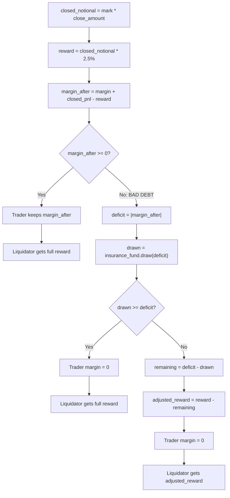

---

## 9. Insurance Fund

```
┌─────────────────────────────────────────────────────────────────┐
│                     INSURANCE FUND                               │
│                                                                 │
│  Storage: MarketFixed.insurance_fund_balance (virtual u64)       │
│  Location: USDC stays in the quote vault; the fund is a          │
│            bookkeeping entry tracking protocol-owned USDC        │
│                                                                 │
│  ┌─────────────────────────────────────────────┐                │
│  │              INFLOWS                         │                │
│  │                                             │                │
│  │  Taker Fee Collection (after every fill):    │                │
│  │    fee = quote_traded * taker_fee_bps / 10000│                │
│  │    trader.quote_balance -= fee               │                │
│  │    insurance_fund_balance += fee             │                │
│  │                                             │                │
│  │  Collected in: Swap, BatchUpdate             │                │
│  └─────────────────────────────────────────────┘                │
│                                                                 │
│  ┌─────────────────────────────────────────────┐                │
│  │              OUTFLOWS                        │                │
│  │                                             │                │
│  │  1. Funding bad debt:                        │                │
│  │     When funding_owed > trader.margin        │                │
│  │     deficit drawn from insurance fund        │                │
│  │                                             │                │
│  │  2. Liquidation bad debt:                    │                │
│  │     When margin_after_reward < 0             │                │
│  │     deficit drawn from insurance fund        │                │
│  │     If insufficient: liquidator reward cut   │                │
│  └─────────────────────────────────────────────┘                │
└─────────────────────────────────────────────────────────────────┘
```

---

## 10. Token Flow & Virtual Base

### 10.1 The Virtual Base Concept

```
┌─────────────────────────────────────────────────────────────────┐
│                     VIRTUAL BASE MODEL                           │
│                                                                 │
│  SPOT CLOB:                                                     │
│    Trader deposits SOL → base_vault                              │
│    Trader deposits USDC → quote_vault                            │
│    Matching moves real tokens between vaults                     │
│                                                                 │
│  PERPS CLOB:                                                    │
│    No base vault exists                                          │
│    Only USDC vault exists                                        │
│    "Base" is a virtual ledger entry                              │
│    Position = signed integer tracking exposure                   │
│                                                                 │
│  WHY:                                                           │
│    Perps don't settle delivery — they settle PnL in USDC        │
│    No need to custody the base asset                             │
│    Simpler vault management, lower account costs                 │
└─────────────────────────────────────────────────────────────────┘
```

### 10.2 Swap Token Flow

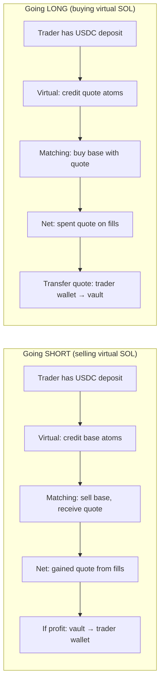

### 10.3 Transaction Lifecycle of base_withdrawable_balance

```
┌─────────────────────────────────────────────────────────────────┐
│     base_withdrawable_balance LIFECYCLE (PER TRANSACTION)        │
│                                                                 │
│  BETWEEN TXs:  Stores last_cumulative_funding (i64 as u64)     │
│                                                                 │
│  ┌──────────────────────────────────────────────────────────┐   │
│  │  1. settle_funding_for_trader()                          │   │
│  │     - Read base_balance as last_cumulative_funding       │   │
│  │     - Compute funding delta                              │   │
│  │     - Adjust quote_balance (real margin)                 │   │
│  │     - SET base_balance = 0  ← zeroed                    │   │
│  └──────────────────────────────────────────────────────────┘   │
│                          │                                      │
│                          ▼                                      │
│  ┌──────────────────────────────────────────────────────────┐   │
│  │  2. Transaction logic (matching, virtual deposits, etc.) │   │
│  │     - base_balance used transiently for virtual credits  │   │
│  │     - Matching engine deducts/credits base               │   │
│  │     - All changes are for CURRENT TX trader only         │   │
│  └──────────────────────────────────────────────────────────┘   │
│                          │                                      │
│                          ▼                                      │
│  ┌──────────────────────────────────────────────────────────┐   │
│  │  3. store_cumulative_for_trader()                        │   │
│  │     - OVERWRITE base_balance with current cumulative     │   │
│  │     - Checkpoints for next transaction's settlement      │   │
│  └──────────────────────────────────────────────────────────┘   │
│                                                                 │
│  BETWEEN TXs:  Stores last_cumulative_funding again             │
└─────────────────────────────────────────────────────────────────┘
```

---

## 11. MagicBlock Integration

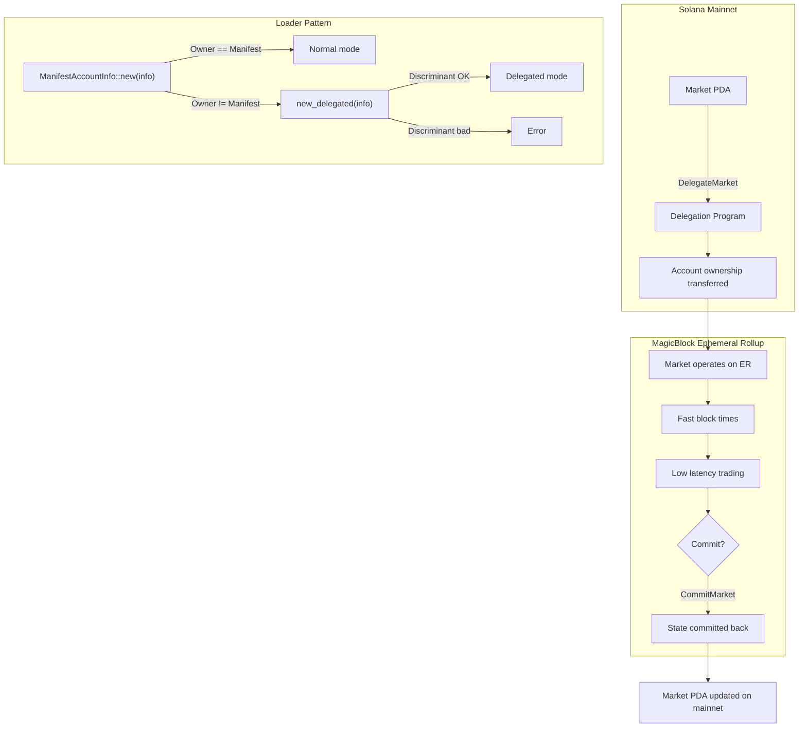

```
Supported Token Programs:
  - SPL Token (mainnet):     TokenkegQfeZyiNwAJbNbGKPFXCWuBvf9Ss623VQ5DA
  - Token-2022:              TokenzQdBNbLqP5VEhdkAS6EPFLC1PHnBqCXEpPxuEb
  - Ephemeral SPL (ER):      SPLxh1LVZzEkX99H6rqYizhytLWPZVV296zyYDPagv2

EphemeralAta layout (72 bytes):
  [owner: Pubkey(32)] [mint: Pubkey(32)] [amount: u64(8)]
  vs SPL Account layout (165 bytes):
  [mint: Pubkey(32)] [owner: Pubkey(32)] [amount: u64(8)] [...]

Detection: data.len() == 72 → EphemeralAta
```

---

## 12. Type System & Price Representation

### QuoteAtomsPerBaseAtom (128-bit Fixed Point)

```
┌─────────────────────────────────────────────────────────────────┐
│            QuoteAtomsPerBaseAtom REPRESENTATION                  │
│                                                                 │
│  Storage: [u64; 2] (128-bit value, avoids alignment issues)     │
│  Encoding: inner_128 = mantissa * 10^(8 - exponent) * D18      │
│  D18 = 10^18 (scaling factor)                                   │
│                                                                 │
│  Mantissa range: 1 to u32::MAX (4,294,967,295)                  │
│  Exponent range: -18 to +8                                      │
│                                                                 │
│  Example: Price of $10.50                                       │
│    mantissa = 1050, exponent = -2                               │
│    inner = 1050 * DECIMAL_CONSTANTS[8 - (-2)]                   │
│         = 1050 * 10^20                                          │
│         = 1.05 * 10^23                                          │
│                                                                 │
│  Special values:                                                │
│    ZERO = [0, 0]                                                │
│    MIN  = (1, -18) → smallest representable price               │
│    MAX  = (u32::MAX, 8) → used as IOC "any price" marker       │
│                                                                 │
│  Conversion:                                                    │
│    quote = inner_128 * base_atoms / D18  (round down)           │
│    base  = D18 * quote_atoms / inner_128 (round down)           │
│                                                                 │
│  Rounding:                                                      │
│    Full fill  → round in taker's favor                          │
│    Partial    → round in maker's favor                          │
└─────────────────────────────────────────────────────────────────┘
```

---

## 13. Log Events

```
┌──────────────────┬───────────────────────────┬────────────────────────────────────┐
│ Log Type          │ Discriminant               │ Key Fields                         │
├──────────────────┼───────────────────────────┼────────────────────────────────────┤
│ CreateMarketLog  │ [33,31,11,6,133,143,39,71]│ market, creator, base/quote_mint   │
│ ClaimSeatLog     │ [129,77,152,210,218,144,  │ market, trader                     │
│                  │  163,56]                   │                                    │
│ DepositLog       │ [23,214,24,34,52,104,     │ market, trader, mint, amount       │
│                  │  109,188]                  │                                    │
│ WithdrawLog      │ [112,218,111,63,18,95,    │ market, trader, mint, amount       │
│                  │  136,35]                   │                                    │
│ FillLog          │ [58,230,242,3,75,113,     │ market, maker, taker, price,       │
│                  │  4,169]                    │ base_atoms, quote_atoms, is_buy    │
│ PlaceOrderLog    │ [157,118,247,213,47,19,   │ market, trader, price, atoms,      │
│                  │  164,120]                  │ seq_num, order_type, is_bid        │
│ CancelOrderLog   │ [22,65,71,33,244,235,     │ market, trader, seq_num            │
│                  │  255,215]                  │                                    │
│ LiquidateLog     │ [232,126,161,135,147,57,  │ market, liquidator, trader,        │
│                  │  82,153]                   │ position, price, pnl(i64→u64),     │
│                  │                           │ close_amount                       │
│ FundingCrankLog  │ [56,41,215,141,163,216,   │ market, cranker, oracle_price,     │
│                  │  83,84]                    │ funding_rate(i64→u64), timestamp   │
└──────────────────┴───────────────────────────┴────────────────────────────────────┘

Note: LiquidateLog.pnl and FundingCrankLog.funding_rate are declared u64
      but store i64 values. Decode as: value as u64 → reinterpret as i64.
```

---

## 14. Safety Invariants

```
┌─────────────────────────────────────────────────────────────────┐
│                    SAFETY INVARIANTS                             │
│                                                                 │
│  1. VIRTUAL BASE ISOLATION                                      │
│     base_withdrawable_balance MUST NOT be modified for makers   │
│     not in the current transaction. It stores their funding     │
│     checkpoint. Only the current-tx trader's base_balance is    │
│     used transiently and overwritten at end.                    │
│                                                                 │
│  2. SETTLE-BEFORE-USE                                           │
│     settle_funding_for_trader() MUST be called before any       │
│     read of quote_balance or position_size. Every processor     │
│     calls it first thing after getting the trader index.        │
│                                                                 │
│  3. STORE-AFTER-USE                                             │
│     store_cumulative_for_trader() MUST be called at the end     │
│     of every processor that touched trader state.               │
│                                                                 │
│  4. FREE BLOCK GUARANTEE                                        │
│     expand_market_if_needed() ensures at least one free block   │
│     exists after every operation that could consume one.         │
│                                                                 │
│  5. SELF-LIQUIDATION PREVENTION                                 │
│     Liquidator pubkey != trader pubkey (prevents insurance       │
│     fund extraction via self-reward).                           │
│                                                                 │
│  6. ORACLE FRESHNESS                                            │
│     Liquidation requires last_funding_timestamp within 3600s.   │
│     Prevents liquidation at stale cached oracle prices.         │
│                                                                 │
│  7. OVERFLOW PROTECTION                                         │
│     All PnL/equity calculations use i128 arithmetic.            │
│     Funding rate clamped to ±1% per period.                     │
│     Time elapsed capped to one funding period per crank.        │
│                                                                 │
│  8. PARAMETER BOUNDS                                            │
│     maintenance_margin > 0                                      │
│     initial_margin >= maintenance_margin                        │
│     initial_margin <= 500%                                      │
│     taker_fee <= 10%                                            │
│     liquidation_buffer < maintenance_margin                     │
│                                                                 │
│  9. ASK CANCELLATION                                            │
│     Cancelling an ask does NOT return base atoms (virtual).     │
│     Only bid cancellation returns quote atoms.                  │
│                                                                 │
│ 10. DUST POSITION CLEANUP                                       │
│     After partial liquidation, if remaining position < 1000     │
│     atoms, rounds up to full liquidation.                       │
└─────────────────────────────────────────────────────────────────┘
```

---

## 15. File Map

```
programs/manifest/src/
├── lib.rs                          # Entrypoint, instruction dispatch
├── logs.rs                         # All log structs + discriminants
├── quantities.rs                   # BaseAtoms, QuoteAtoms, QuoteAtomsPerBaseAtom
├── utils.rs                        # create_account, discriminant helpers
│
├── program/
│   ├── mod.rs                      # ManifestError enum, expand helpers
│   ├── instruction.rs              # ManifestInstruction enum (0-17)
│   └── processor/
│       ├── create_market.rs        # Market + vault PDA creation
│       ├── claim_seat.rs           # Register trader seat
│       ├── deposit.rs              # USDC deposit + funding settle
│       ├── withdraw.rs             # USDC withdrawal + margin check
│       ├── swap.rs                 # IOC market order (primary trading)
│       ├── batch_update.rs         # Cancel N + place M orders
│       ├── liquidate.rs            # Partial/full liquidation + mark price
│       ├── crank_funding.rs        # Pyth oracle + funding rate update
│       ├── expand.rs               # Grow market account
│       ├── delegate.rs             # MagicBlock delegation
│       ├── commit.rs               # MagicBlock commit
│       └── global_*.rs             # Global cross-market operations
│
├── state/
│   ├── market.rs                   # MarketFixed, matching engine, perps logic
│   ├── market_helpers.rs           # Refactored place_order (formal verification)
│   ├── claimed_seat.rs             # 64-byte trader seat (field repurposing)
│   ├── resting_order.rs            # Order node in orderbook
│   ├── constants.rs                # Sizes, discriminants
│   └── global.rs                   # Global cross-market state
│
├── validation/
│   ├── loaders.rs                  # All *Context structs (account loading)
│   ├── manifest_checker.rs         # ManifestAccountInfo, get_market_address
│   ├── token_checkers.rs           # get_vault_address, EphemeralAta
│   └── solana_checkers.rs          # Signer, Program, EmptyAccount
│
└── program/instruction_builders/   # Client-side instruction builders
    ├── create_market_instructions.rs
    ├── liquidate_instruction.rs
    └── ...
```
